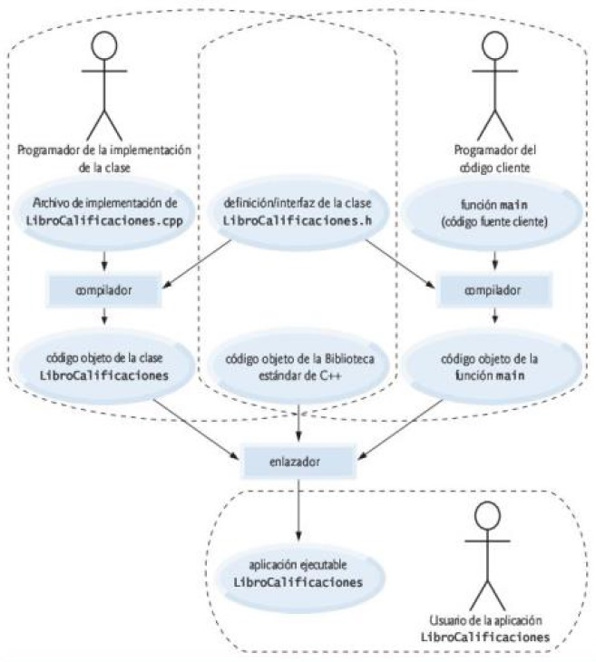

# C++

<a id="index"></a>

## Índice

Prácticas:

1. [Ejercicios resueltos del libro **C++ Cómo programar** - Deitel (9na ed.)](deitel/index.md)

Sobre el lenguaje:

1. [Compilación y ejecución](#section-01)
1. [Elementos](#section-02)
1. [Palabras clave](#section-03)
1. [Operadores](#section-04)
1. [Sentencias de control](#section-05)
1. [Funciones](#section-06)
1. [Clases](#section-07)
1. [Biblioteca estándar](#section-08)

Tips de programación:

1. [Introducción a las computadoras y a C++](docs/chapter-01.md)
1. [Introducción a la programación en C++, entrada/salida y operadores](docs/chapter-02.md)
1. [Introducción a las clases, objetos y cadenas](docs/chapter-03.md)
1. [Instrucciones de control, parte 1: operadores de asignación, ++ y --](docs/chapter-04.md)
1. [Instrucciones de control, parte 2: operadores lógicos](docs/chapter-05.md)
1. [Funciones y una introducción a la recursividad](docs/chapter-06.md)

<a id="section-01"></a>

## Compilación y ejecución

Compilación:

```bash
# con código objeto
gcc main.cpp -o main.o

# con ejecutable
gcc main.cpp -o main.exe
```

Ejecución:

```bash
# ruta desde la posición actual
./main.exe
```

Enlazar con la librería estándar:

```bash
gcc main.cpp -lstdc++ -o main.o

# g++ enlaza por defecto
g++ main.cpp -o main.o
```

Mostrar todos los errores cuando el código es compilado:

```bash
g++ -Wall -Wextra -Werror -c main.cpp -o main.o
```

Compilar y enlazar varios archivos:

```bash
g++ main.cpp other.cpp -o main.exe

# ó por separado
g++ -c main.cpp
g++ -c other.cpp
g++ main.o other.o
./a.out

# con ejecutable
g++ main.o other.o -o main.exe
```



<a id="section-02"></a>

## Elementos

Espacios en blanco:

```c++
// Líneas en blanco:            "\n"
// Caracteres de espacio:       "  "
// Caracteres de tabulación:    "\t"
```

Secuencias de escape:

1. Carácter de escape: `\`
1. Secuencia de escape: `\n`

Secuencia de escape|Descripción
:---|:---
`\n`|Nueva línea.
`\t`|Tabulador horizontal.
`\r`|Retorno de carro.
`\a`|Alerta.
`\\`|Barra diagonal inversa.
`\'`|Comilla sencilla.
`\"`|Doble comilla.

Comentarios:

```c++
// Comentario de una línea.

/*
 * Comentario de
 * varias líneas.
 */
```

Directiva del preprocesador:

```c++
#include <iostream>     // librería estándar
#include "MiClase.h"    // librería personalizada
```

Espacio de nombres:

```c++
// en cada instrucción
std::cout << "...";

// en todo el código
using std::cout;        // declaraciones using
using namespace std;    // directivas using

// Los encabezados nunca deben contener estas declaraciones o directivas
```

Instrucciones:

1. Instrucción compleja o bloque: `{ }`
1. Instrucción nula o vacía: `;`

Declaración de variables:

```c++
int numero = 0;
```

Inicialización de listas: generan errores de compilación si los tipos no corresponden.

```c++
// declaración de variable
int numero = { 0 };

// ó
int numero{ 0 };

// en objetos
int objeto{ "valor1", "valor2", 0 };
int objeto = { "valor1", "valor2", 0 };
```

Tipos de datos:

<!-- TODO: caracteres ASCII -->
1. `char`
1. `short`
1. `int`
1. `long`
1. `long long`
1. `float`
1. `double`

Terminología por su ubicación respecto al operador de asignación:

- Variables: **lvalues**
- Constantes: **rvalues**

<a id="section-03"></a>

## Palabras clave

Palabras clave comunes para los lenguajes de programación C y C++:

```
auto                break               case                char                const
continue            default             do                  double              else
enum                extern              float               for                 goto
if                  int                 long                register            return
short               signed              sizeof              static              struct
switch              typedef             union               unsigned            void
volatile            while
```

Palabras clave sólo de C++:

```
and                 and_eq              asm                 bitand              bitor
bool                catch               class               compl               const_cast
delete              dynamic_cast        explicit            export              false
friend              inline              mutable             namespace           new
not                 not_eq              operator            or                  or_eq
private             protected           public              reinterpret_cast    static_cast
template            this                throw               true                try
typeid              typename            using               virtual             wchar_t
xor                 xor_eq
```

Palabras clave de C++ 11:

```
alignas             alignof             char16_t            char32_t            constexpr
decltype            noexcept            nullptr             static_assert       thread_local
```

<a id="section-04"></a>

## Operadores

Tipos de operadores:

- Operadores unarios:
    - static_cast
    - de incremento
    - de decremento
- Operadores binarios:
    - de asignación.
    - de asignación aritméticos.
    - aritméticos.
    - relacionales.
    - de igualdad.
    - lógicos.
- Operador ternario:
    - Operador condicional: `?:`
- Otros:
    - Operador coma: `,`
    - Operador de inserción de flujo: `<<`
    - Operador de extracción de flujo: `>>`
    - Operador de resolución de ámbito: `::`

Operador static_cast:

```c++
static_cast< /* tipo */ >( /* expresión */ )
```

Operadores de incremento y decremento:

Operación|Operador
:---|:---:
Incremento|`++`
Decremento|`--`
Preincremento|`++a`
Postincremento|`a++`
Predecremento|`--a`
Postdecremento|`a--`

Operadores de asignación:

Operación|Operador
:---|:---:
Asignación|`=`
Asignación suma|`+=`
Asignación resta|`-=`
Asignación multiplicación|`*=`
Asignación división|`/=`
Asignación módulo|`%=`

Operadores aritméticos:

Operación|Operador
:---|:---:
Suma|`+`
Resta|`-`
Multiplicación|`*`
División|`/`
Módulo|`%`

Operadores relacionales:

Operación|Operador
:---|:---:
Mayor que|`>`
Menor que|`<`
Mayor o igual que|`>=`
Menor o igual que|`<=`

Operadores de igualdad:

Operación|Operador
:---|:---:
Es igual a|`==`
No es igual a|`!=`

Operadores lógicos:

Operación|Operador
:---|:---:
Operador AND lógico|`&&`
Operador OR lógico|`||`
Operador lógico de negación|`!`

Reglas de precedencia de operadores:
1. `::` `()` Paréntesis
1. `++` `--` (postfijo) `static_cast<type>()`
1. `++` `--` (prefijo) `+` `-` `!`
1. `*`, `/`, `%`
1. `+`, `-`
1. `<<` `>>`
1. `<` `<=` `>` `>=`
1. `==` `!=`
1. `&&`
1. `||`
1. `?:`
1. `=` `+=` `-=` `*=` `/=` `%=`
1. `,`

<a id="section-05"></a>

## Sentencias de control

Instrucciones o "estructuras" de control:

- **de secuencia**
- **de selección**:
    - **Instrucción de selección simple**: `if`
    - **Instrucción de selección doble**: `if...else`
    - **Instrucción de selección múltiple**: `switch`
- **de repetición** (o **de ciclo** o **ciclos**):
    - `while`
    - `do...while`
    - `for`

Instrucción de selección `if`:

```c++
if ( /* condición */ )
    // instrucción
```

Instrucción de selección doble `if...else`:

```c++
if ( /* condición */ )
    // instrucción
else
    // instrucción
```

Instrucción de selección múltiple `switch`:

```c++
switch ( /* condición */ )
{
    case value:
        // instrucción
        break;

    // cases...

    default:
        // instrucción
        break;
}
```

Instrucción de repetición `while`:

```c++
while ( /* condición */ )
    // instrucción
```

Instrucción de repetición `do...while`:

```c++
do
{
    // instrucción
}
while ( /* condición */ );
```

Instrucción de repetición `for`:

```c++
for ( /* inicialización */; /* condición */; /* incremento */ )
{
    // instrucción
}
```

Instrucción `break`:
- Salir de `while`, `for`, `do...while`, o `switch`.

Instrucción `continue`:
- Ir a la siguiente iteración de `while`, `for`, o `do...while`.

<a id="section-06"></a>

## Funciones

```c++
int main( /* parameters */ )
{
    // code...

    return // something...
}
```

<a id="section-07"></a>

## Clases

```c++
// definición de la clase
// nomenclatura de Pascal o CamelCase
class NombreClase
{
    // especificadores de acceso: public o private

    public:
        // constructor
        // explicit: para constructores con sólo un parámetro
        explicit NombreClase( std::string nombre1, std::string nombre2, std::string nombre3 )
			: nombreDato1 ( nombre1 ),
              nombreDato2 ( nombre2 ),
              nombreDato3 ( nombre3 )
		{
			// cuerpo del constructor
            // validaciones de los argumentos
		}

        // funciones miembro
        // nombres en camelCase
        // const: si la función no debería modificar el objeto
        void nombreFuncion() const
        {
            // code...
        }

    private:
        // encapsulamiento
        // datos miembro
        // nombres en camelCase
        std::string nombreDato1;
        std::string nombreDato2;
        std::string nombreDato3;

    // funciones establecer: mutadores
    // funciones obtener: accesores
};

NombreClase objetoClase;
NombreClase objetoClase( "dato1", "dato2", "dato3" );

objetoClase.nombreFuncion();
```

Constructores predeterminados:

- De manera *implícita* si no contiene constructores definidos por el usuario.
- De manera *explícita*, llamará al constructor predeterminado para cada dato miembro que sea objeto de otra clase y realizará las inicializaciones adicionales especificadas.
- Con argumentos no se creará de manera implícita un constructor predeterminado. C++ permite forzar su construcción.

Separar interfaz de la implementación:

- Usa prototipos de las funciones.

<a id="section-08"></a>

## Biblioteca estándar

### iostream

Encabezado de flujos de entrada/salida.

- `cout`: flujo de salida
- `cin`: flujo de entrada

Manipuladores de flujo:

- `endl`: imprime nueva línea y vacía el búfer de salida
- `fixed`: muestra los decimales, así sean puros ceros (Manipulador pegajoso)
- `showpoint`: muestra el punto decimal si es necesario (Manipulador pegajoso)
- `left`: justificación izquierda
- `right`: justificación derecha
- `boolalpha`: para mostrar los valores booleanos como *true* o *false* (Manipulador pegajoso)

Otros:

- `EOF`: ctrl + d / ctrl + z
- `cin.get`: lee un carácter del teclado
- `getline()`

Clase String:

- `size()`
- `substr()`

### iomanip

Manipuladores de flujo parametrizados.

- `setprecision()`: redondea al número indicado de decimales (Manipulador pegajoso)
- `setw()`: anchura de campo, justificado a la derecha, sólo para el siguiente valor que se imprima

### cmath

- `pow()`

### climits

- `INT_MAX`
- `INT_MIN`
- `UINT_MAX`

### cfloat

[Arriba][Index]

[Index]: #index
