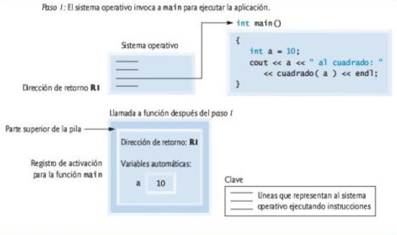
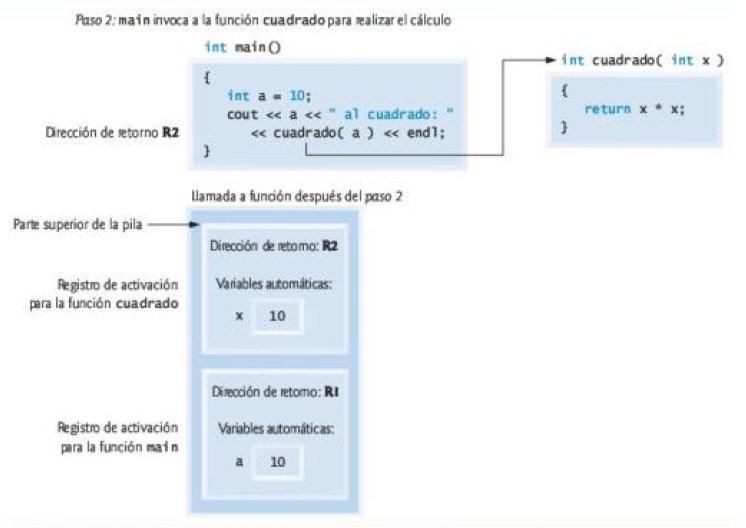
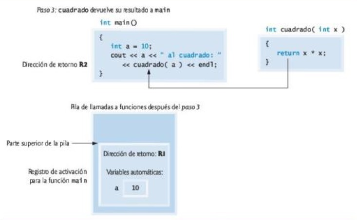

# C++

<a id="index"></a>

## Índice

Prácticas:

1. [Ejercicios resueltos del libro **C++ Cómo programar** - Deitel (9na ed.)](deitel/index.md)

Sobre el lenguaje:

1. [Compilación y ejecución](#section-01)
1. [Elementos](#section-02)
1. [Palabras clave](#section-03)
1. [Operadores](#section-04)
1. [Sentencias de control](#section-05)
1. [Manejo de excepciones](#section-06)
1. [Funciones](#section-07)
1. [Clases](#section-08)
1. [Apuntadores o punteros](#section-09)
1. [Pilas](#section-10)
1. [Biblioteca estándar](#section-11)

Tips de programación:

1. [Introducción a las computadoras y a C++](docs/chapter-01.md)
1. [Introducción a la programación en C++, entrada/salida y operadores](docs/chapter-02.md)
1. [Introducción a las clases, objetos y cadenas](docs/chapter-03.md)
1. [Instrucciones de control, parte 1: operadores de asignación, ++ y --](docs/chapter-04.md)
1. [Instrucciones de control, parte 2: operadores lógicos](docs/chapter-05.md)
1. [Funciones y una introducción a la recursividad](docs/chapter-06.md)
1. [Plantillas de clase **array** y **vector**; cómo atrapar excepciones](docs/chapter-07.md)
1. [Apuntadores](docs/chapter-08.md)

Términos clave:

1. [En el libro **C++ Cómo programar** - Deitel (9na ed.)](docs/keywords.md)

<a id="section-01"></a>

## Compilación y ejecución

Compilación:

```bash
# con código objeto
gcc main.cpp -o main.o

# con ejecutable
gcc main.cpp -o main.exe
```

Ejecución:

```bash
# ruta desde la posición actual
./main.exe
```

Enlazar con la librería estándar:

```bash
gcc main.cpp -lstdc++ -o main.o

# g++ enlaza por defecto
g++ main.cpp -o main.o
```

Mostrar todos los errores cuando el código es compilado:

```bash
g++ -Wall -Wextra -Werror -c main.cpp -o main.o
```

Compilar y enlazar varios archivos:

```bash
g++ main.cpp other.cpp -o main.exe

# ó por separado
g++ -c main.cpp
g++ -c other.cpp
g++ main.o other.o
./a.out

# con ejecutable
g++ main.o other.o -o main.exe
```


<a id="section-02"></a>

## Elementos

Espacios en blanco:

```c++
// Líneas en blanco:            "\n"
// Caracteres de espacio:       "  "
// Caracteres de tabulación:    "\t"
```

Secuencias de escape:

```c++
// Carácter de escape:  '\'
// Secuencia de escape: '\n'
```

Secuencia de escape|Descripción
:---|:---
`\n`|Nueva línea.
`\t`|Tabulador horizontal.
`\r`|Retorno de carro.
`\a`|Alerta.
`\\`|Barra diagonal inversa.
`\'`|Comilla sencilla.
`\"`|Doble comilla.

Comentarios:

```c++
// Comentario de una línea.

/*
 * Comentario de
 * varias líneas.
 */
```

Directiva del preprocesador:

```c++
#include <iostream>     // librería estándar
#include "MiClase.h"    // librería personalizada
```

Espacio de nombres:

```c++
// en cada instrucción
std::cout << "...";

// en todo el código
using std::cout;        // declaraciones using
using namespace std;    // directivas using

// Los encabezados nunca deben contener estas declaraciones o directivas
```

Instrucciones:

1. Instrucción compleja o bloque: `{ }`
1. Instrucción nula o vacía: `;`

Declaración de variables:

```c++
int numero = 0;
```

Inicialización de listas: generan errores de compilación si los tipos no corresponden.

```c++
// declaración de variable
int numero = { 0 };

// ó
int numero{ 0 };

// en objetos
int objeto{ "valor1", "valor2", 0 };
int objeto = { "valor1", "valor2", 0 };
```

Tipos de datos fundamentales:

<!-- TODO: caracteres ASCII -->
1. `char`
1. `short`
1. `int`
1. `long`
1. `long long`
1. `float`
1. `double`
1. `long double`
1. `bool`
1. `size_t`: tamaño o subíndices de arreglos

Tipos de datos definidos por el usuario:

- Enumeraciones sin alcance:

```c++
// por defecto los valores inician en 0
// el tipo depende de los valores de las constantes
enum NombreEnum
{
    VALOR1,
    VALOR2,
    VALOR3,
    ETC
};

NombreEnum variableEnum = VALOR1;

enum NombreEnum : unsigned int
{
    VALOR1 = 0,
    VALOR2 = 1,
    VALOR3 = 2
};

NombreEnum variableEnum = NombreEnum::VALOR2;
```

- Enumeraciones con alcance:

```c++
// también "enum struct"
// se puede indicar su tipo
enum class NombreEnum : tipo_valores
{
    VALOR1,
    VALOR2,
    VALOR3,
    ETC
};

NombreEnum variableEnum = NombreEnum::VALOR1;
```

Cadenas:

1. Clase **string**.
1. Cadenas basadas en punteros (cadenas de C).

Estructuras de datos:

- Arreglos

```c++
std::array< /* tipo, tamaño */ > nombreArreglo = {}; // inicializa en cero
std::array< /* tipo, tamaño */ > nombreArreglo = { valor1, valor2, etcétera };
```

- Vectores

```c++
std::vector< /* tipo */ > nombreVector( /* tamaño */ );
std::vector< /* tipo */ > nombreVector = { valor1, valor2, etcetera };
```

- Arreglos integrados

```c++
// nombreArreglo contiene la dirección de memoria de nombreArreglo[0]
/* tipo */ nombreArreglo[ /* tamañoArreglo*/ ] = { valor1, valor2, etcétera };

// cadenas de caracteres
char cadena[] = "inicializacion";
const char *cadenaPtr = "inicializacion";
// o
char cadena[] = { 'a', 'b', 'c', 'd', '\0' };
```

Limitaciones:
- No pueden compararse mediante operadores relacionales.
- No pueden asignarse unos a otros.
- No conocen su propio tamaño.
- No cuentan con comprobación de límites automática.

Uso:
- En argumentos de línea de comandos.

Terminología por su ubicación respecto al operador de asignación:

- **lvalues**: Variables.
- **rvalues**: Constantes y **lvalues**.

Jerarquía de promociones para los tipos de datos fundamentales:

1. `long double`
1. `double`
1. `float`
1. `unsigned long long int` (sinónimo con `unsigned long long`)
1. `long long int`          (sinónimo con `long long`)
1. `unsigned long int`      (sinónimo con `unsigned long`)
1. `long int`               (sinónimo con `long`)
1. `unsigned int`           (sinónimo con `unsigned`)
1. `int`
1. `unsigned short int`     (sinónimo con `unsigned short`)
1. `short int`              (sinónimo con `short`)
1. `unsigned char`
1. `char` y `signed char`
1. `bool`

Duración/Clases de almacenamiento:

1. Automática: existen mientras esté activo el bloque en el que se definen.
    1. Variables locales declaradas en funciones
    1. Parámetros de funciones
    1. Variables locales o parámetros de funciones declarados con `register`
    1. `register`: los datos se cargan en los registros, para cálculos y otros tipos de procesamiento, si hubieran registros disponibles.
1. Estática: existen en toda la duración del programa y mantienen su valor.
    1. Variables globales y funciones globales.
    1. Variables locales con `static`.
    1. `extern`
    1. `static`: conservan su valor cuando la función que las contiene se vuelve a llamar.
    1. `static`: en una clase implica que ese dato será compartido por todos los objetos, también puede ser usado directamente sin crear objetos.
1. Dinámica
1. De hilo

<a id="section-03"></a>

## Palabras clave

Palabras clave comunes para los lenguajes de programación C y C++:

```
auto                break               case                char                const
continue            default             do                  double              else
enum                extern              float               for                 goto
if                  int                 long                register            return
short               signed              sizeof              static              struct
switch              typedef             union               unsigned            void
volatile            while
```

Palabras clave sólo de C++:

```
and                 and_eq              asm                 bitand              bitor
bool                catch               class               compl               const_cast
delete              dynamic_cast        explicit            export              false
friend              inline              mutable             namespace           new
not                 not_eq              operator            or                  or_eq
private             protected           public              reinterpret_cast    static_cast
template            this                throw               true                try
typeid              typename            using               virtual             wchar_t
xor                 xor_eq
```

Palabras clave de C++ 11:

```
alignas             alignof             char16_t            char32_t            constexpr
decltype            noexcept            nullptr             static_assert       thread_local
```

<a id="section-04"></a>

## Operadores

Tipos de operadores:

- Operadores unarios:
    - static_cast
    - de incremento
    - de decremento
    - de resolución de ámbito: `::`
    - dirección: `&`
    - indirección: `*`
- Operadores binarios:
    - de asignación.
    - de asignación aritméticos.
    - aritméticos.
    - relacionales.
    - de igualdad.
    - lógicos.
- Operador ternario:
    - Operador condicional: `?:`
- Otros:
    - Operador coma: `,`
    - Operador de inserción de flujo: `<<`
    - Operador de extracción de flujo: `>>`
    - de resolución de ámbito: `::`
    - Operador en tiempo de compilación: `sizeof`

Operador static_cast:

```c++
static_cast< /* tipo */ >( /* expresión */ )
```

Operadores de incremento y decremento:

Operación|Operador
:---|:---:
Incremento|`++`
Decremento|`--`
Preincremento|`++a`
Postincremento|`a++`
Predecremento|`--a`
Postdecremento|`a--`

Operadores de asignación:

Operación|Operador
:---|:---:
Asignación|`=`
Asignación suma|`+=`
Asignación resta|`-=`
Asignación multiplicación|`*=`
Asignación división|`/=`
Asignación módulo|`%=`

Operadores aritméticos:

Operación|Operador
:---|:---:
Suma|`+`
Resta|`-`
Multiplicación|`*`
División|`/`
Módulo|`%`

Operadores relacionales:

Operación|Operador
:---|:---:
Mayor que|`>`
Menor que|`<`
Mayor o igual que|`>=`
Menor o igual que|`<=`

Operadores de igualdad:

Operación|Operador
:---|:---:
Es igual a|`==`
No es igual a|`!=`

Operadores lógicos:

Operación|Operador
:---|:---:
Operador AND lógico|`&&`
Operador OR lógico|`||`
Operador lógico de negación|`!`

Reglas de precedencia de operadores:

Operadores|Asociatividad|Tipo
:---|:---|:---
`::` `()`|izquierda a derecha|primario
`()` `[]` `++` `--` `static_cast<type>()`|izquierda a derecha|postfijo
`++` `--` `+` `-` `!` `&` `*`|derecha a izquierda|unario (prefijo)
`*`, `/`, `%`|izquierda a derecha|multiplicativa
`+`, `-`|izquierda a derecha|aditiva
`<<` `>>`|izquierda a derecha|inserción/extracción
`<` `<=` `>` `>=`|izquierda a derecha|relacional
`==` `!=`|izquierda a derecha|igualdad
`&&`|izquierda a derecha|AND lógico
`\|\|`|izquierda a derecha|OR lógico
`?:`|derecha a izquierda|condicional
`=` `+=` `-=` `*=` `/=` `%=`|derecha a izquierda|asignación
`,`|izquierda a derecha|coma

Orden de evaluación de los operandos (C++ sólo especifica para estos):
- `&&`: de izquierda a derecha
- `||`: de izquierda a derecha
- `,`: de izquierda a derecha
- `?:`: de más a la izquierda, luego el intermedio ó el de más a la derecha

<a id="section-05"></a>

## Sentencias de control

Instrucciones o "estructuras" de control:

- **de secuencia**
- **de selección**:
    - **Instrucción de selección simple**: `if`
    - **Instrucción de selección doble**: `if...else`
    - **Instrucción de selección múltiple**: `switch`
- **de repetición** (o **de ciclo** o **ciclos**):
    - `while`
    - `do...while`
    - `for`

Instrucción de selección `if`:

```c++
if ( /* condición */ )
    // instrucción
```

Instrucción de selección doble `if...else`:

```c++
if ( /* condición */ )
    // instrucción
else
    // instrucción
```

Instrucción de selección múltiple `switch`:

```c++
switch ( /* condición */ )
{
    case value:
        // instrucción
        break;

    // cases...

    default:
        // instrucción
        break;
}
```

Instrucción de repetición `while`:

```c++
while ( /* condición */ )
    // instrucción
```

Instrucción de repetición `do...while`:

```c++
do
{
    // instrucción
}
while ( /* condición */ );
```

Instrucción de repetición `for`:

```c++
for ( /* inicialización */; /* condición */; /* incremento */ )
{
    // instrucción
}
```

Instrucción `for` basada en rango:

```c++
for ( /* declaración variable rango */ : /* expresión */ )
{
    // instrucción
}

// auto: infiere el tipo de la variable
// const: no puede usarse para modificar la referencia
// &: usa la referencia y evita la copia a la variable de rango
for ( auto const & /* declaración variable rango */ : /* expresión */ )
{
    // instrucción
}
```

Instrucción `break`:
- Salir de `while`, `for`, `do...while`, o `switch`.

Instrucción `continue`:
- Ir a la siguiente iteración de `while`, `for`, o `do...while`.

<a id="section-06"></a>

## Manejo de excepciones

```c++
try
{
    // code...
}
catch ( out_of_range &ex )
{
    cerr << "Ocurrio una excepcion: " << ex.what() << endl;
}
```

<a id="section-06"></a>

## Funciones

```c++
int nombreFuncion( /* parameters */ )
{
    // code...

    return // something...
}

// el compilador incluirá una copia de la definición de esta función
// en el cuerpo normal del programa
inline int nombreFuncion();

// paso por referencia
int nombreFuncion( int & ); // ó
int nombreFuncion( int& );

// argumentos predeterminados deben estar más a la derecha
int nombreFuncion( int paramPred = 0 );
```

Plantillas de funciones:

```c++
// o template < class T >
// T: receptáculo para los tipos fundamentales o definidos por el usuario
template < typename T >
T maximo( T valor1, T valor2, T valor3 )
{
    // code...
}

// tipos de valores de retorno al final
// para plantillas de funciones más complejas
auto maximo( T valor1, T valor2, T valor3 ) -> T
```

Arreglos integrados como argumentos:

```c++
int nomFunc( const int arreglo[] ) // equivalente a
int nomFunc( const int *arreglo )
```

Punteros como argumentos:

```c++
// apuntador no constante a datos no constantes
void nomFunc( int *puntero )

// apuntador no constante a datos constantes
void nomFunc( const int *puntero )

// apuntador constante a datos no constantes
// se debe inicializar
int * const ptr = &x;

// apuntador constante a datos constantes
// se debe inicializar
const int * const ptr = &x;
```

<a id="section-07"></a>

## Clases

```c++
// definición de la clase
// nomenclatura de Pascal o CamelCase
class NombreClase
{
    // especificadores de acceso: public o private

    public:
        // constructor
        // explicit: para constructores con sólo un parámetro
        explicit NombreClase( std::string nombre1 )

        // con varios parámetros
        NombreClase( std::string nombre1, std::string nombre2, std::string nombre3 )
			: nombreDato1 ( nombre1 ),
              nombreDato2 ( nombre2 ),
              nombreDato3 ( nombre3 )
		{
			// cuerpo del constructor
            // validaciones de los argumentos
		}

        // funciones miembro
        // nombres en camelCase
        // const: si la función no debería modificar el objeto
        // const: no modificará el parámetro
        void nombreFuncion(const std::string &) const
        {
            // code...
        }

    private:
        // encapsulamiento
        // datos miembro
        // nombres en camelCase
        std::string nombreDato1;
        std::string nombreDato2;
        std::string nombreDato3;

    // funciones establecer: mutadores
    // funciones obtener: accesores
};

NombreClase objetoClase;
NombreClase objetoClase( "dato1", "dato2", "dato3" );

objetoClase.nombreFuncion();
```

Constructores predeterminados:

- De manera *implícita* si no contiene constructores definidos por el usuario.
- De manera *explícita*, llamará al constructor predeterminado para cada dato miembro que sea objeto de otra clase y realizará las inicializaciones adicionales especificadas.
- Con argumentos no se creará de manera implícita un constructor predeterminado. C++ permite forzar su construcción.

Separar interfaz de la implementación:

- Usa prototipos de las funciones.

Plantillas de clase:

```c++
uniform_int_distribution<tipo int> nombreDistribución( /* Rango: mínimo, máximo */ );
```

<a id="section-08"></a>

## Apuntadores o punteros

Almacena la dirección de memoria. Hace referencia indirecta a un valor.

```c++
// punteros nulo anteriores a C++11
int *nombrePuntero = 0;
int *nombrePuntero = NULL;

// puntero nulo C++11
int *nombrePuntero = nullptr;
```

Aritmética: sólo para arreglos integrados
- Incrementar (`++`) o decrementar (`--`).
- Sumar un entero (`+` o `+=`).
- Restar un entero (`-` o `-=`).
- Restar un apuntador de otro.

Notación apuntador/desplazamiento:

```c++
// equivalente a arreglo[ 3 ]
*( arregloPtr + 3 )
// ó
*( arreglo + 3 )
```

Notación apuntador/subíndice:

```c++
// equivalente a arregloPtr + 3
arregloPtr[ 3 ]
```

<a id="section-09"></a>

## Pilas

La pila de llamadas a funciones y los registros de activación:





<a id="section-09"></a>

## Biblioteca estándar

Encabezado|Explicación
:---|:---
`<iostream>`|Contiene prototipos de función para las funciones de entrada y salida estándar de C++.
`<iomanip>`|Contiene prototipos de función para los manipuladores de flujo que dan formato a flujos de datos.
`<cmath>`|Contiene prototipos de función para las funciones de la biblioteca de matemáticas.
`<cstdlib>`|Contiene prototipos de función para las conversiones de números a texto, de texto a números, asignación de memoria, números aleatorios y varias otras funciones utilitarias.
`<ctime>`|Contiene prototipos de función y tipos para manipular la hora y la fecha.
`<array>`, `<vector>`, `<list>`, `<forward_list>`, `<deque>`, `<queue>`, `<stack>`, `<map>`, `<unordered_map>`, `<unordered_set>`, `<set>`, `<bitset>`|Estos encabezados contienen clases que implementan los contenedores de la Biblioteca estándar de C++. Los contenedores almacenan datos durante la ejecución de un programa.
`<cctype>`|Contiene prototipos de función para las funciones que evalúan caracteres en base a ciertas propiedades (por ejemplo, si el carácter es un dígito o un signo de puntuación), y prototipos de funciones que se pueden utilizar para convertir letras minúsculas a mayúsculas y viceversa.
`<cstring>`|Contiene prototipos de funciones para las funciones de procesamiento de cadenas estilo C.
`<typeinfo>`|Contiene clases para la identificación de tipos en tiempo de ejecución (determinar los tipos de datos en tiempo de ejecución).
`<exception>`, `<stdexcept>`|Estos encabezados contienen clases que se utilizan para manejar excepciones.
`<memory>`|Contiene clases y funciones utilizadas por la Biblioteca estándar de C++ para asignar memoria a los contenedores de la Biblioteca estándar de C++.
`<fstream>`|Contiene prototipos de funciones para las funciones que realizan operaciones de entrada desde archivos en disco, y operaciones de salida hacia archivos en disco.
`<string>`|Contiene la definición de la clase `string` de la Biblioteca estándar de C++.
`<sstream>`|Contiene prototipos de función para las funciones que realizan operaciones de entrada a partir de cadenas en memoria, y operaciones de salida hacia cadenas en memoria.
`<functional>`|Contiene las clases y funciones utilizadas por algoritmos de la Biblioteca estándar de C++.
`<iterator>`|Contiene clases para acceder a los datos en los contenedores de la Biblioteca estándar de C++.
`<algorithm>`|Contiene las funciones para manipular los datos en los contenedores de la Biblioteca estándar de C++.
`<cassert>`|Contiene macros para agregar diagnósticos que ayuden a depurar programas (debug).
`<cfloat>`|Contiene los límites del sistema en cuanto al tamaño de los números de punto flotante.
`<climits>`|Contiene los límites del sistema en cuanto al tamaño de los números enteros.
`<cstdio>`|Contiene los prototipos de función para las funciones de la biblioteca de entrada/salida estándar estilo C.
`<locale>`|Contiene clases y funciones que se utilizan comúnmente en el procesamiento de flujos, para procesar datos en la forma natural para distintos lenguajes (por ejemplo, formatos monetarios, almacenamiento de cadenas, presentación de caracteres, etcétera).
`<limits>`|Contiene clases para definir los límites de los tipos de datos numéricos en cada plataforma computacional.
`<utility>`|Contiene clases y funciones utilizadas por muchos encabezados de la Biblioteca estándar de C++.

`<random>`|.
`<cstddef>`|.

### iostream

Encabezado de flujos de entrada/salida.

- `cout`: flujo de salida
- `cin`: flujo de entrada

Manipuladores de flujo:

- `endl`: imprime nueva línea y vacía el búfer de salida
- `fixed`: muestra los decimales, así sean puros ceros (Manipulador pegajoso)
- `showpoint`: muestra el punto decimal si es necesario (Manipulador pegajoso)
- `left`: justificación izquierda
- `right`: justificación derecha
- `boolalpha`: para mostrar los valores booleanos como *true* o *false* (Manipulador pegajoso)

Otros:

- `EOF`: ctrl + d / ctrl + z
- `cin.get`: lee un carácter del teclado
- `std::getline()`
- `cin.getline()`: arreglo integrado, número de caracteres y carácter delimitador.

Clase String:

- `std::string`
- `size()`
- `substr()`

### iomanip

Manipuladores de flujo parametrizados.

- `std::setprecision()`: redondea al número indicado de decimales (Manipulador pegajoso)
- `setw()`: anchura de campo, justificado a la derecha, sólo para el siguiente valor que se imprima

### cmath

Función|Descripción
:---|:---
`ceil( x )`|Redondea *x* al valor entero más pequeño que no sea menor que *x*
`cos( x )`|Coseno trigonométrico de *x* (*x* está en radianes)
`exp( x )`|Función exponencial *e^x*
`fabs( x )`|Valor absoluto de *x*
`floor( x )`|Redondea *x* al entero más grande, no mayor a *x*
`fmod( x )`|Residuo de *x/y* como número de punto flotante
`log( x )`|Logaritmo natural de *x* (base *e*)
`log10( x )`|Logaritmo de *x* (base 10)
`pow( x )`|*x* elevado a la potencia *y* (*x^y*)
`sin( x )`|Seno trigonométrico de *x* (*x* en radianes)
`sqrt( x )`|Raíz cuadrada de *x* (en donde *x* es un valor no negativo)
`tan( x )`|Tangente trigonométrica de *x* (*x* en radianes)

### cstdlib

- `RAND_MAX`: límite de la función `rand`
- `rand()`: genera un número aleatorio entre 0 y `RAND_MAX`
- `srand( unsigned int )`: siembra el generador `rand` en base al argumento ingresado

### ctime

- `time( 0 )`: devuelve el número de segundos desde enero 1, 1970 a media noche en GMT. De tipo `time_t`

### array

- `array`: tamaño estático
- `size()`
- `begin()`
- `end()`

### vector

- `vector`: tamaño dinámico
- `size()`
- `at()`: arroja una excepción si se accede fuera de los límites
- `push_back`: agrega un nuevo elemento al vector

### stdexcept

- `out_of_range`: tipo de excepción
- `what()`: el mensaje de error almacenado en el parámetro de error

### climits

- `INT_MAX`
- `INT_MIN`
- `UINT_MAX`

### iterator

- `begin()`: para arreglos integrados
- `end()`: para arreglos integrados

### algorithm

- `sort()`
- `binary_search()`

### cfloat

### cerrno

### cstddef

- `size_t`

### random

- `default_random_engine()`: motor de generación de números aleatorios predeterminado
- `uniform_int_distribution<>`: distribuye uniformemente los enteros seudoaleatorios. Rango predeterminado de 0 al valor máximo de un `int`

- `errno`: `EDOM`

[Arriba][Index]

[Index]: #index
