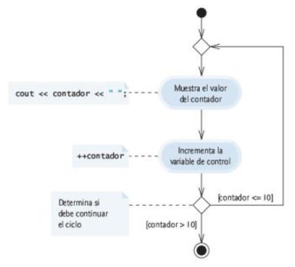
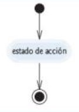

# UML

## Diagrama de clases de UML

Se divide en:
1. **Compartimiento superior**:
    - Nombre de la clase.
    - Centrado en horizontal
    - En negrita.
2. **Compartimiento de en medio**:
    - Atributos de la clase.
    - Nombre seguido de dos puntos y del tipo de atributo.
3. **Compartimiento inferior**:
    - Operaciones de la clase
    - Nombre seguido de paréntesis.
    - Seguido de dos puntos y el **tipo de valor de retorno** de la operación.
    - Parámetros: Nombre seguido de dos puntos y del tipo de parámetro.
    - Anteceder `<<constructor>>` antes del signo del constructor.

Atributos y operaciones antecedidos por:
- **Signo más (+)**:
    - Operación **public**.
- **Signo menos (-)**:
    - Operación **private**.

*Fig. 1.1 - Diagrama de clases en UML.*

## Diagrama de actividad en UML

Elementos:
1. **Estado inicial**:
    - Círculo relleno.
    - Inicio del flujo.
1. **Símbolos de estado de acción**:
    - Rectángulos con arcos en los lados derecho e izquierdo.
    - Contienen una **expresión de acción**.
1. **Flechas de transición**.
1. **Símbolo de decisión**:
    - Rombo.
    - **Condiciones de guardia** entre corchetes.
    - Una flecha *entrante* y dos o más *salientes*.
1. **Símbolo de fusión**:
    - Rombo.
    - Une dos flujos de actividad en un solo flujo de actividad.
    - Dos o más flechas *entrantes* y una *saliente*.
1. **Notas**:
    - Rectángulos con la esquina superior derecha doblada.
    - Conectadas por una línea punteada.
1. **Estado final**:
    - Círculo sólido.
    - Final del flujo.

*Fig. 2.1 - Diagrama de actividad de una estructura de secuencia.*

*Fig. 2.2 - Diagrama de actividad de la instrucción `if` de selección simple.*

*Fig. 2.3 - Diagrama de actividad de la instrucción `if...else` de selección doble.*

*Fig. 2.4 - Diagrama de actividad de la instrucción de repetición `while`.*

*Fig. 2.5 - Diagrama de actividad de la instrucción de repetición `for`.*

*Fig. 2.6 - Diagrama de actividad de la instrucción de repetición `do...while`.*

*Fig. 2.7 - Diagrama de actividad de la instrucción `switch` de selección múltiple con instrucciones `break`.*

## Resumen de programación estructurada

Reglas para formar programas estructurados:

1. Comenzar con el "diagrama de actividad más sencillo" (figura 3.2).
1. Cualquier estado de acción puede reemplazarse por dos estados de acción en secuencia (**Regla de apilamiento**).
1. Cualquier estado de acción puede reemplazarse por cualquier instrucción de control (secuencia, `if`, `if...else`, `switch`, `while`, `do...while` o `for`) (**Regla de anidamiento**).
1. Las reglas 2 y 3 pueden aplicarse tantas veces como se desee y en cualquier orden.

(Las líneas punteadas no son parte de UML)

*Fig. 3.1 - Instrucciones de secuencia, selección y repetición de una sola entrada/una sola salida de C++.*

*Fig. 3.2 - El diagrama de actividad más sencillo.*

*Fig. 3.3 - El resultado de aplicar la regla 2 repetidamente al diagrama de actividad más sencillo.*

*Fig. 3.3 - El resultado de aplicar la regla 3 repetidamente al diagrama de actividad más sencillo.*

*Cualquier* forma de control necesaria en un programa de C++ puede expresarse en términos de:
- **secuencia**
- instrucción `if` (**selección**)
- instrucción `while` (**repetición**)
las cuales pueden combinarse en sólo *dos* formas: **apilamiento** y **anidamiento**.
